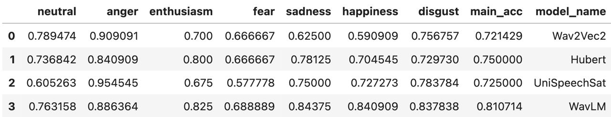

 **Aniemore** - это открытая библиотека искусственного интеллекта для потоковой аналитики эмоциональных оттенков речи человека.

[](https://colab.research.google.com/drive/1_W2ngr_ShrLdTLVTBP3XF176JW1zdChl)

[](https://img.shields.io/pypi/v/aniemore)
[](https://img.shields.io/pypi/pyversions/aniemore)
[](https://img.shields.io/pypi/wheel/aniemore)
[](https://img.shields.io/pypi/l/aniemore)
[](https://img.shields.io/pypi/status/aniemore)
[](https://pypistats.org/packages/aniemore)
[](https://github.com/aniemore/Aniemore/actions/workflows/github-code-scanning/codeql)
[](https://github.com/aniemore/Aniemore/actions/workflows/bandit.yml)

#### Основные технические параметры

- Объем набора данных Russian Emotional Speech Dialogues содержит более 3000 аудиофрагментов представляющих 200 различных людей;
- Модели способны распознавать эмоции в зашумленных аудиофайлах длительностью в 3 секунды;
- Скорость обработки и ответа модели составляет не более 5 секунд;
- Пословная ошибка модели WER 30%;
- Совокупная точность модели 75%
- Диапазон распознавания эмоций: злость, отвращение, страх, счастье, интерес, грусть, нейтрально;
- Акустические возможности - 3 уровня.


## Описание
Aniemore - это библиотека для Python, которая позволяет добавить в ваше 
программное обеспечение возможность определять эмоциональный фон речи человека, как в голосе, 
так и в тексте. Для этого в библиотеке разработано два соответсвующих модуля - Voice и Text.

Aniemore содержит свой собственный датасет RESD (Russian Emotional Speech Dialogues) и другие 
наборы данных разного объема, которые вы можете использовать для обучения своих моделей.

| Датасет        | Примечание                                                                  |
|----------------|-----------------------------------------------------------------------------|
| RESD           | 7 эмоций, 4 часа аудиозаписей диалогов **студийное качество**               |
| RESD_Annotated | RESD + speech-to-text аннотации                                             |
| REPV           | 2000 голосовых сообщений (.ogg), 200 актеров, 2 нейтральные фразы, 5 эмоций |
| REPV-S         | 140 голосовых сообщений (.ogg) "Привет, как дела?" с разными эмоциями       |

Вы можете использовать готовые предобученные модели из библиотеки: 

| Модель                                                                                                                           | Точность |
|----------------------------------------------------------------------------------------------------------------------------------|----------|
| Голосовые модели                                                                                                                 |          |
| [**wav2vec2-xlsr-53-russian-emotion-recognition**](https://huggingface.co/Aniemore/wav2vec2-xlsr-53-russian-emotion-recognition) | 73%      |
| [**wav2vec2-emotion-russian-resd**](https://huggingface.co/Aniemore/wav2vec2-emotion-russian-resd)                               | 75%      |
| [**wavlm-emotion-russian-resd**](https://huggingface.co/Aniemore/wavlm-emotion-russian-resd)                                     | 82%      |
| [**hubert-emotion-russian-resd**](https://huggingface.co/Aniemore/hubert-emotion-russian-resd)                                   | 75%      |
| [**unispeech-sat-emotion-russian-resd Copied**](https://huggingface.co/Aniemore/unispeech-sat-emotion-russian-resd)              | 72%      |
| [**wavlm-bert-base**](https://huggingface.co/Aniemore/wavlm-bert-base-s-emotion-russian-resd)                                                           | 81%      |
| [**wavlm-bert-fusion**](https://huggingface.co/Aniemore/wavlm-bert-fusion-s-emotion-russian-resd)                                | 83%      |
| Текстовые модели                                                                                                                 |          |
| [**rubert-base-emotion-russian-cedr-m7**](https://huggingface.co/Aniemore/rubert-base-emotion-russian-cedr-m7)                   | 74%      |
| [**rubert-tiny2-russian-emotion-detection**](https://huggingface.co/Aniemore/rubert-tiny2-russian-emotion-detection)             | 85%      |
| [**rubert-large-emotion-russian-cedr-m7**](https://huggingface.co/Aniemore/rubert-large-emotion-russian-cedr-m7)                 | 76%      |
| [**rubert-tiny-emotion-russian-cedr-m7**](https://huggingface.co/Aniemore/rubert-tiny-emotion-russian-cedr-m7)                   | 72%      |

#### Показатели моделей в разрезе эмоций



## <a name="Install"></a>	Установка
```shell
pip install aniemore
```
## <a name="Install"></a>	Минимальные требования к оборудованию

| Архитектура              | ЦПУ    | ОЗУ   | SSD   |
|--------------------------|--------|-------|-------|
| **Wave2Vec2**            | 2 ядра | 8 ГБ  | 40 ГБ |
| **WaveLM**               | 2 ядра | 8 ГБ  | 40 ГБ |
| **Hubert**               | 2 ядра | 8 ГБ  | 40 ГБ |
| **UniSpeechSAT**         | 2 ядра | 8 ГБ  | 40 ГБ |
| **Bert_Tiny/Bert_Tiny2** | 2 ядра | 4 ГБ  | 40 ГБ |
| **Bert_Base**            | 2 ядра | 4 ГБ  | 40 ГБ |
| **Bert_Large**           | 2 ядра | 8 ГБ  | 40 ГБ |
| **WavLM Bert Base**      | 2 ядра | 16 ГБ | 40 ГБ |
| **WavLM Bert Fusion**    | 2 ядра | 16 ГБ | 40 ГБ |
| **Whisper Tiny**         | 2 ядра | 4 ГБ  | 40 ГБ |
| **Whisper Base**         | 2 ядра | 4 ГБ  | 40 ГБ |
| **Whisper Small**        | 2 ядра | 4 ГБ  | 40 ГБ |
| **Whisper Medium**       | 2 ядра | 8 ГБ  | 40 ГБ |
| **Whisper Large**        | 2 ядра | 16 ГБ | 40 ГБ |
| **TextEnhancer**         | 2 ядра | 4 ГБ  | 40 ГБ |
<hr>

### Пример использования

Ниже приведены простые примеры использования библиотеки. Для более детальных примеров, в том числе **загрузка cобственной модели** - смотрите сделанный для этого *Google Colab*

[](https://colab.research.google.com/drive/1_W2ngr_ShrLdTLVTBP3XF176JW1zdChl)
#### Распознавание эмоций в тексте
```python
import torch
from aniemore.recognizers.text import TextRecognizer
from aniemore.models import HuggingFaceModel

model = HuggingFaceModel.Text.Bert_Tiny2
device = 'cuda' if torch.cuda.is_available() else 'cpu'
tr = TextRecognizer(model=model, device=device)

tr.recognize('это работает? :(', return_single_label=True)
```
#### Распознавание эмоций в голосе

```python
import torch
from aniemore.recognizers.voice import VoiceRecognizer
from aniemore.models import HuggingFaceModel

model = HuggingFaceModel.Voice.WavLM
device = 'cuda' if torch.cuda.is_available() else 'cpu'
vr = VoiceRecognizer(model=model, device=device)
vr.recognize('/content/ваш-звуковой-файл.wav', return_single_label=True)
```
#### Распознавание эмоций (мультимодальный метод)

```python
import torch
from aniemore.recognizers.multimodal import VoiceTextRecognizer
from aniemore.utils.speech2text import SmallSpeech2Text
from aniemore.models import HuggingFaceModel

model = HuggingFaceModel.MultiModal.WavLMBertFusion
s2t_model = SmallSpeech2Text()

text = SmallSpeech2Text.recognize('/content/ваш-звуковой-файл.wav').text
device = 'cuda' if torch.cuda.is_available() else 'cpu'

vtr = VoiceTextRecognizer(model=model, device=device)
vtr.recognize(('/content/ваш-звуковой-файл.wav', text), return_single_label=True)
```
#### Распознавание эмоций (мультимодальный метод с автоматическим распознаванием речи)

```python
import torch
from aniemore.recognizers.multimodal import MultiModalRecognizer
from aniemore.utils.speech2text import SmallSpeech2Text
from aniemore.models import HuggingFaceModel

model = HuggingFaceModel.MultiModal.WavLMBertFusion
device = 'cuda' if torch.cuda.is_available() else 'cpu'
mr = MultiModalRecognizer(model=model, s2t_model=SmallSpeech2Text(), device=device)
mr.recognize('/content/ваш-звуковой-файл.wav', return_single_label=True)
```
<hr>

## Доп. ссылки

Все модели и датасеты, а так же примеры их использования вы можете посмотреть в нашем [HuggingFace профиле](https://huggingface.co/Aniemore)

## Аффилированость
**Aniemore (Artem Nikita Ilya EMOtion REcognition)**

Разработка открытой библиотеки произведена коллективом авторов на базе ООО "Социальный код".
Результаты работы получены за счет гранта Фонда содействия развитию малых форм предприятий в научно-технической сфере (Договор №1ГУКодИИС12-D7/72697
от 22.12.2021).

## Цитирование
```
@misc{Aniemore,
  author = {Артем Аментес, Илья Лубенец, Никита Давидчук},
  title = {Открытая библиотека искусственного интеллекта для анализа и выявления эмоциональных оттенков речи человека},
  year = {2022},
  publisher = {GitHub},
  journal = {GitHub repository},
  howpublished = {\url{https://github.com/aniemore/Aniemore}},
  email = {hello@socialcode.ru}
}
```
